# Prompt maestro — **Real Elegance** · Plataforma de sastrería artesanal

> **Este archivo es la especificación de referencia del proyecto.** Es la fuente de verdad
> de decisiones de stack, estructura, paleta y modelo de datos. Cualquier sesión de trabajo
> (humana o de IA) debe leerlo antes de tocar código, y actualizarlo aquí si una decisión cambia.
>
> Bitácora de avance por sesión: [ESTADO.md](ESTADO.md)

---

> **Rol para la IA / equipo dev:** Actúa como arquitecto de software full‑stack senior. Construye una aplicación web de producción para **Real Elegance**, una sastrería artesanal de trajes a medida, siguiendo *al pie de la letra* las decisiones de stack, estructura, paleta y modelo de datos descritas abajo. No inventes tecnologías fuera de las indicadas. Entrega código idiomático, tipado, probado y dockerizado. Documenta cada módulo.

---

## 1. Contexto de negocio

Real Elegance vende trajes a medida y confección artesanal. La plataforma cubre dos mundos que deben convivir:

- **Experiencia del cliente (tienda + autoservicio):** explorar catálogo, personalizar, cotizar, agendar cita, dejar medidas y anticipo, confirmar pedido y **seguir el avance de su confección en línea**.
- **Gestión interna (taller):** convertir un pedido en orden de trabajo, asignar sastre, controlar corte → confección → prueba/ajustes → entrega, y gestionar citas, pagos y medidas.

**Flujo del cliente (secuencia real, respétala en la UI y el modelo de estados):**
`1. Explorar catálogo → 2. Personalizar traje (2D, ver §13) → 3. Solicitar cotización → 4. Agendar cita → 5. Medidas y anticipo → 6. Pedido confirmado → 7. Confección y pruebas → 8. Pago final y entrega.`

> **Carrito de compras (ver §12):** el cliente añade al carrito trajes configurados (**a medida**) y/o accesorios **listos para llevar** (corbatas, pañuelos, camisas). Desde el carrito hace *checkout*, que **origina el pedido** (`sp_create_order`). El traje a medida requiere anticipo + cita de medidas; el accesorio se paga completo y se envía. El carrito es el puente entre los pasos 2→3 y 5→6.

**Flujo interno:** `Pedido → Orden de trabajo → Asignación al sastre → Corte → Confección → Prueba y ajustes → Entrega.`

**Identidad:** elegante, artesanal, premium. Idioma de la interfaz: **español**.

---

## 2. Stack tecnológico (obligatorio)

| Capa | Tecnología |
|---|---|
| Frontend | **React 18 + Vite + TypeScript** |
| Estilos | CSS Modules + **design tokens** (variables CSS globales). Sin librerías de UI pesadas |
| Estado servidor | **TanStack Query (React Query)** |
| Estado cliente | **Context API + `useReducer`** (solo transversal: auth, carrito de personalización, tema) |
| Formularios | **React Hook Form + Zod** |
| Ruteo | **React Router v6** con lazy loading |
| Backend | **Node.js + TypeScript + Express** (arquitectura por capas) |
| Validación API | **Zod** |
| Base de datos | **PostgreSQL 16** (3FN, triggers, procedimientos, vistas) |
| Acceso a datos | **Knex** para migraciones/queries + SQL crudo para triggers/procedimientos |
| Auth | **JWT** (access + refresh) + **bcrypt** + RBAC por roles |
| Contenedores | **Docker + docker-compose** (multi‑stage) |
| Calidad | ESLint + Prettier + Husky + **Vitest** + React Testing Library |
| Docs API | **OpenAPI/Swagger** en `/api/docs` |

> Estructura de repositorio: **monorepo** con `apps/web`, `apps/api` y `packages/shared` (tipos y esquemas Zod compartidos entre front y back).

---

## 3. Paleta de color global — *design tokens*

Define un único archivo `packages/shared/tokens.css` (o `apps/web/src/styles/tokens.css`) como **fuente de verdad**. Nada de colores hardcodeados en componentes: todo consume estas variables.

```css
:root {
  /* Base — negro / dorado / blanco */
  --re-noir:        #0E0C0A;   /* fondo principal (negro cálido)      */
  --re-onyx:        #14110C;   /* superficies elevadas                */
  --re-onyx-2:      #1D1912;   /* tarjetas / paneles                  */
  --re-gold:        #C6A253;   /* dorado principal (antiguo, sobrio)  */
  --re-gold-bright: #E6CC86;   /* dorado de acento / hover            */
  --re-gold-deep:   #8C6E2E;   /* dorado apagado / bordes             */
  --re-ivory:       #F4EFE4;   /* texto y superficies claras          */
  --re-muted:       #9B917E;   /* texto secundario                    */
  --re-line:        rgba(198,162,83,.22); /* líneas tipo patrón sastre */

  /* Semánticos (usa SIEMPRE estos en componentes) */
  --color-bg:            var(--re-noir);
  --color-surface:       var(--re-onyx);
  --color-surface-raised:var(--re-onyx-2);
  --color-primary:       var(--re-gold);
  --color-primary-hover: var(--re-gold-bright);
  --color-text:          var(--re-ivory);
  --color-text-muted:    var(--re-muted);
  --color-border:        var(--re-line);

  /* Estado */
  --color-success: #6FA86B;
  --color-warning: var(--re-gold-bright);
  --color-danger:  #C1553F;

  /* Tipografía */
  --font-display: "Cormorant Garamond", Georgia, serif; /* titulares alta costura */
  --font-sans:    "Jost", "Inter", system-ui, sans-serif; /* UI / cuerpo */

  /* Escala / radios / sombras */
  --space-unit: 8px;
  --radius-sm: 6px; --radius-md: 12px; --radius-lg: 20px;
  --shadow-1: 0 2px 12px rgba(0,0,0,.35);
  --shadow-gold: 0 0 0 1px var(--re-gold-deep), 0 8px 30px rgba(198,162,83,.12);
}
```

> **Motivo de marca (firma visual):** líneas doradas finas y marcas de medida tipo cinta métrica / patrón de sastre (bordes con guiones, ticks). Reutilízalo como lenguaje visual, no como decoración aleatoria.

---

## 4. Arquitectura general

```
real-elegance/
├─ apps/
│  ├─ web/            # React + Vite
│  └─ api/            # Node + Express
├─ packages/
│  └─ shared/         # tipos TS + esquemas Zod + tokens
├─ db/
│  ├─ migrations/     # Knex (DDL, índices)
│  ├─ sql/            # triggers.sql, functions.sql, procedures.sql, views.sql
│  └─ seeds/
├─ docker-compose.yml
└─ .env.example
```

---

## 5. Frontend — estructura y mejores prácticas de React

### 5.1 Estructura por *features* (feature-based, no por tipo de archivo)

```
apps/web/src/
├─ app/               # bootstrap: providers, router raíz
├─ routes/            # definición de rutas + lazy()
├─ layouts/           # AppLayout, AuthLayout
├─ pages/             # 1 archivo por ruta (compone features)
├─ features/
│  ├─ catalog/        # componentes, hooks, api, types del catálogo
│  ├─ customization/  # selección de tela/opciones (carrito)
│  ├─ cart/           # carrito, drawer, checkout
│  ├─ appointments/   # agendar cita
│  ├─ orders/         # crear/confirmar pedido
│  ├─ tracking/       # seguimiento del pedido
│  ├─ admin/          # back-office: catálogo, imágenes, telas, tablero taller
│  └─ auth/
├─ components/ui/     # design system: Button, Card, Input, Badge, Stepper…
├─ context/           # AuthContext, CartContext, ThemeContext
├─ hooks/             # hooks reutilizables (useMediaQuery, useDebounce…)
├─ api/               # cliente axios + interceptores
├─ lib/               # utilidades puras
├─ styles/            # tokens.css, global.css
└─ types/
```

### 5.2 Reglas de componentes
- **Componentes pequeños y de una sola responsabilidad.** Separa presentacionales (sin lógica de datos) de contenedores (traen datos vía hooks).
- **Composición sobre props booleanas infinitas.** Usa `children` y *slots* (`<Card><Card.Header/></Card>`).
- Un **design system mínimo** en `components/ui` (`Button`, `Input`, `Card`, `Badge`, `Stepper`, `Modal`, `Toast`) que consuma solo tokens. Ningún color/spacing mágico fuera de ahí.
- Tipar **todas** las props; nada de `any`. Reutiliza tipos desde `packages/shared`.

### 5.3 Hooks
- Extrae lógica repetida a **custom hooks**: `useCatalog`, `useOrder`, `useOrderTracking`, `useAppointments`, `useAuth`, `useCart`.
- Respeta las **reglas de hooks** (nivel superior, orden estable).
- `useMemo`/`useCallback` **solo cuando hay costo real** o dependencias de referencia; no optimizes prematuramente.
- Efectos con dependencias correctas y limpieza (`return () => …`). Nada de lógica de render dentro de `useEffect` que se pueda derivar.

### 5.4 Context vs estado de servidor (clave)
- **NO** guardes datos del servidor en Context. Los datos remotos (catálogo, pedidos, citas) viven en **React Query** (caché, revalidación, estados `isLoading/isError`, mutaciones optimistas).
- Context solo para estado **transversal de cliente**: sesión (`AuthContext`), **carrito de compras** (`CartContext`, con `useReducer` + persistencia en `localStorage` para invitados y sincronización a `CARTS`/`CART_ITEMS` al iniciar sesión), tema.
- Divide contextos por dominio para evitar renders innecesarios; memoiza el `value`.

### 5.5 Datos, formularios, ruteo
- **React Query** para todo fetch/mutación; claves de query namespaced (`['orders', id]`). Invalidación tras mutaciones.
- **React Hook Form + Zod** en cotización, cita y checkout; reutiliza los esquemas Zod de `packages/shared` (mismos que valida el backend).
- **React Router v6**: rutas por feature, `lazy()` + `<Suspense>` para code-splitting, rutas protegidas por rol (`<RequireRole role="tailor">`).

### 5.6 Calidad transversal (piso mínimo, sin anunciarlo)
- Accesible: HTML semántico, foco visible por teclado, `aria-*` donde aplique, `prefers-reduced-motion` respetado.
- **Error Boundaries** por feature + estados vacíos/errores con copy útil (“No hay pedidos aún. Diseña tu primer traje.”).
- Variables de entorno vía `import.meta.env.VITE_*`.
- Tests: unitarios de hooks/utils con Vitest; de componentes con Testing Library (interacción, no implementación).

---

## 6. Backend — arquitectura por capas

```
apps/api/src/
├─ config/        # env, db pool, logger (pino)
├─ routes/        # /api/v1/* → controllers
├─ controllers/   # HTTP in/out, sin lógica de negocio
├─ services/      # lógica de negocio; orquesta repos + procedimientos SQL
├─ repositories/  # acceso a datos (Knex) + llamada a funciones/procs
├─ middlewares/   # auth, rbac, validate(zod), errorHandler, rateLimit
├─ schemas/       # Zod (importa de packages/shared)
└─ index.ts
```

**Prácticas obligatorias:**
- REST versionada `/api/v1`, respuestas y errores con forma consistente (`{ data }` / `{ error: { code, message } }`).
- Middleware de **validación Zod** por endpoint; **RBAC** por rol (`admin`, `tailor`, `staff`, `customer`).
- Seguridad: `helmet`, CORS restringido, rate limiting, **bcrypt** para passwords, JWT access (corto) + refresh (rotación).
- Transacciones para operaciones compuestas (crear pedido, registrar pago) — **delegadas a procedimientos almacenados** cuando toquen varias tablas.
- Logging estructurado (pino), manejo central de errores, healthcheck `/health`.
- Swagger en `/api/docs`.

---

## 7. Base de datos — modelo relacional en **3FN**

**Principios:** cada tabla en Tercera Forma Normal (sin dependencias transitivas ni parciales), catálogos/*lookups* para todo valor repetible (estados, tipos, métodos), llaves subrogadas `id BIGINT GENERATED ALWAYS AS IDENTITY`, `created_at/updated_at`, borrado lógico donde aplique. Medidas modeladas como *type + value* (evita tablas anchas y facilita agregar medidas nuevas sin DDL).

### 7.1 Diagrama Entidad‑Relación

```mermaid
erDiagram
    ROLES ||--o{ USERS : "clasifica"
    USERS ||--o| CUSTOMERS : "es"
    USERS ||--o| STAFF : "es"

    CUSTOMERS ||--o{ ADDRESSES : "tiene"
    CUSTOMERS ||--o{ MEASUREMENT_SETS : "registra"
    MEASUREMENT_SETS ||--o{ MEASUREMENT_VALUES : "contiene"
    MEASUREMENT_TYPES ||--o{ MEASUREMENT_VALUES : "define"

    FABRIC_CATEGORIES ||--o{ FABRICS : "agrupa"
    SUIT_STYLES ||--o{ SUIT_MODELS : "clasifica"
    SUIT_MODELS ||--o{ SUIT_IMAGES : "galería"
    FABRICS ||--o{ FABRIC_IMAGES : "muestrario"
    USERS ||--o{ MEDIA_ASSETS : "sube"

    PRODUCT_CATEGORIES ||--o{ PRODUCTS : "agrupa"
    PRODUCTS ||--o{ PRODUCT_IMAGES : "galería"
    CUSTOMERS ||--o{ CARTS : "posee"
    CARTS ||--o{ CART_ITEMS : "contiene"
    SUIT_MODELS ||--o{ CART_ITEMS : "a medida"
    FABRICS ||--o{ CART_ITEMS : "tela"
    PRODUCTS ||--o{ CART_ITEMS : "listo"
    COUPONS ||--o{ ORDERS : "descuenta"

    OPTION_GROUPS ||--o{ OPTION_VALUES : "contiene"

    CUSTOMERS ||--o{ QUOTES : "solicita"
    CUSTOMERS ||--o{ ORDERS : "realiza"
    ORDER_STATUSES ||--o{ ORDERS : "estado"
    QUOTES ||--o| ORDERS : "origina"

    ORDERS ||--o{ ORDER_ITEMS : "detalle"
    SUIT_MODELS ||--o{ ORDER_ITEMS : "modelo"
    FABRICS ||--o{ ORDER_ITEMS : "tela"
    MEASUREMENT_SETS ||--o{ ORDER_ITEMS : "medidas"
    ORDER_ITEMS ||--o{ ORDER_ITEM_CUSTOMIZATIONS : "personaliza"
    OPTION_VALUES ||--o{ ORDER_ITEM_CUSTOMIZATIONS : "opción"

    ORDERS ||--o{ WORK_ORDERS : "genera"
    STAFF ||--o{ WORK_ORDERS : "asignado"
    PRODUCTION_STAGES ||--o{ WORK_ORDERS : "etapa"
    ORDERS ||--o{ ORDER_STATUS_HISTORY : "bitácora"

    CUSTOMERS ||--o{ APPOINTMENTS : "agenda"
    STAFF ||--o{ APPOINTMENTS : "atiende"
    APPOINTMENT_TYPES ||--o{ APPOINTMENTS : "tipo"

    ORDERS ||--o{ PAYMENTS : "recibe"
    PAYMENT_METHODS ||--o{ PAYMENTS : "método"
    ORDERS ||--o| DELIVERIES : "entrega"
    ADDRESSES ||--o{ DELIVERIES : "destino"

    ROLES {
        bigint id PK
        string name UK
        string description
    }
    USERS {
        bigint id PK
        bigint role_id FK
        string email UK
        string password_hash
        boolean is_active
        timestamp created_at
    }
    CUSTOMERS {
        bigint id PK
        bigint user_id FK "UK"
        string first_name
        string last_name
        string phone
    }
    STAFF {
        bigint id PK
        bigint user_id FK "UK"
        string specialty
        boolean is_available
        date hire_date
    }
    ADDRESSES {
        bigint id PK
        bigint customer_id FK
        string line1
        string city
        string state
        string postal_code
        boolean is_default
    }
    MEASUREMENT_TYPES {
        bigint id PK
        string code UK
        string name
        string unit
    }
    MEASUREMENT_SETS {
        bigint id PK
        bigint customer_id FK
        bigint taken_by FK "staff"
        timestamp taken_at
    }
    MEASUREMENT_VALUES {
        bigint id PK
        bigint measurement_set_id FK
        bigint measurement_type_id FK
        numeric value_cm
    }
    FABRIC_CATEGORIES {
        bigint id PK
        string name UK
    }
    FABRICS {
        bigint id PK
        bigint category_id FK
        string code UK
        string name
        string composition
        numeric price_per_meter
        numeric stock_meters
        boolean is_active
    }
    SUIT_STYLES {
        bigint id PK
        string name UK
    }
    SUIT_MODELS {
        bigint id PK
        bigint style_id FK
        string code UK
        string name
        numeric base_price
        boolean is_active
    }
    MEDIA_ASSETS {
        bigint id PK
        bigint uploaded_by FK "user"
        string storage_key UK "ruta/objeto"
        string url
        string mime_type
        int width
        int height
        int size_bytes
        timestamp created_at
    }
    SUIT_IMAGES {
        bigint id PK
        bigint suit_model_id FK
        bigint media_asset_id FK
        string alt_text
        int sort_order
        boolean is_primary
    }
    FABRIC_IMAGES {
        bigint id PK
        bigint fabric_id FK
        bigint media_asset_id FK
        string alt_text
        int sort_order
        boolean is_primary
    }
    OPTION_GROUPS {
        bigint id PK
        string name UK "solapa, forro, botones, aberturas"
    }
    OPTION_VALUES {
        bigint id PK
        bigint option_group_id FK
        string name
        numeric price_delta
    }
    QUOTES {
        bigint id PK
        bigint customer_id FK
        string quote_number UK
        numeric estimated_total
        date valid_until
        string status
    }
    ORDER_STATUSES {
        bigint id PK
        string code UK
        string name
        int sort_order
    }
    ORDERS {
        bigint id PK
        bigint customer_id FK
        bigint status_id FK
        bigint quote_id FK
        string order_number UK
        numeric subtotal
        numeric tax
        numeric total
        numeric deposit_paid
        numeric balance_due
        date promised_date
        timestamp created_at
        timestamp updated_at
    }
    ORDER_ITEMS {
        bigint id PK
        bigint order_id FK
        bigint suit_model_id FK
        bigint fabric_id FK
        bigint measurement_set_id FK
        int quantity
        numeric unit_price
        numeric line_total
    }
    ORDER_ITEM_CUSTOMIZATIONS {
        bigint id PK
        bigint order_item_id FK
        bigint option_value_id FK
        numeric price_delta
    }
    PRODUCTION_STAGES {
        bigint id PK
        string code UK "corte, confeccion, prueba, ajustes, entrega"
        string name
        int sort_order
    }
    WORK_ORDERS {
        bigint id PK
        bigint order_id FK
        bigint assigned_tailor_id FK
        bigint stage_id FK
        timestamp started_at
        timestamp due_at
        timestamp completed_at
    }
    ORDER_STATUS_HISTORY {
        bigint id PK
        bigint order_id FK
        bigint status_id FK
        bigint changed_by FK
        timestamp changed_at
        string note
    }
    APPOINTMENT_TYPES {
        bigint id PK
        string name UK "medidas, prueba, consulta, entrega"
    }
    APPOINTMENTS {
        bigint id PK
        bigint customer_id FK
        bigint staff_id FK
        bigint appointment_type_id FK
        timestamp scheduled_at
        int duration_min
        string status
    }
    PAYMENT_METHODS {
        bigint id PK
        string name UK
    }
    PAYMENTS {
        bigint id PK
        bigint order_id FK
        bigint payment_method_id FK
        numeric amount
        string payment_type "anticipo, saldo"
        timestamp paid_at
        string reference
    }
    DELIVERIES {
        bigint id PK
        bigint order_id FK "UK"
        bigint address_id FK
        date scheduled_date
        timestamp delivered_at
        string status
    }
    PRODUCT_CATEGORIES {
        bigint id PK
        string name UK
    }
    PRODUCTS {
        bigint id PK
        bigint category_id FK
        string sku UK
        string name
        numeric price
        int stock
        boolean is_active
    }
    PRODUCT_IMAGES {
        bigint id PK
        bigint product_id FK
        bigint media_asset_id FK
        int sort_order
        boolean is_primary
    }
    CARTS {
        bigint id PK
        bigint customer_id FK "null = invitado"
        string session_token
        string status "active, converted, abandoned"
        timestamp created_at
        timestamp updated_at
    }
    CART_ITEMS {
        bigint id PK
        bigint cart_id FK
        string item_type "made_to_measure, ready_to_wear"
        bigint suit_model_id FK "null si RTW"
        bigint fabric_id FK "null si RTW"
        bigint product_id FK "null si MTM"
        jsonb config "snapshot opciones MTM"
        int quantity
        numeric unit_price
    }
    COUPONS {
        bigint id PK
        string code UK
        string type "percent, fixed"
        numeric value
        numeric min_subtotal
        date valid_until
        int usage_limit
        boolean is_active
    }
```



### 7.2 Notas de normalización (3FN)
- Todo atributo depende **solo** de la clave. Ej.: el precio del modelo vive en `SUIT_MODELS`, no se copia en `ORDER_ITEMS` salvo `unit_price` **congelado** al momento de compra (dato histórico legítimo, no redundancia).
- Los valores repetibles (estados, etapas, métodos de pago, tipos de cita, tipos de medida) están en tablas *lookup* → sin cadenas repetidas ni dependencias transitivas.
- Relación N:M `order_item ↔ option_value` resuelta con la tabla puente `ORDER_ITEM_CUSTOMIZATIONS`.
- Medidas como `type + value` → agregar “ancho de hombro” es insertar en `MEASUREMENT_TYPES`, sin `ALTER TABLE`.
- **Imágenes normalizadas:** el archivo físico vive **una sola vez** en `MEDIA_ASSETS` (con sus metadatos: mime, dimensiones, tamaño). `SUIT_IMAGES` / `FABRIC_IMAGES` / `PRODUCT_IMAGES` son las relaciones 1:N que ordenan la galería (`sort_order`) y marcan la portada (`is_primary`). Esto evita el `image_url` suelto y permite reutilizar un mismo asset y tener varias fotos por traje/producto.
- **Carrito pragmático vs pedido normalizado:** `CART_ITEMS` es **transitorio**; para el traje a medida guarda las opciones elegidas como snapshot en `config JSONB` (evita 3 tablas puente para algo efímero). Al hacer *checkout*, `sp_create_order` **expande** ese snapshot a las tablas totalmente normalizadas del pedido (`ORDER_ITEMS` + `ORDER_ITEM_CUSTOMIZATIONS`). Lo permanente queda en 3FN; lo efímero, ágil.
- `ORDERS` incorpora `coupon_id` (FK, null), `discount_amount` — el descuento aplicado se **congela** en el pedido (dato histórico), no depende del estado vivo del cupón.

---

## 8. Índices (rendimiento e integridad)

- **Únicos:** `users(email)`, `orders(order_number)`, `fabrics(code)`, `suit_models(code)`, `quotes(quote_number)`, `deliveries(order_id)`, y compuesto único `measurement_values(measurement_set_id, measurement_type_id)`.
- **FKs:** Postgres **no** indexa llaves foráneas automáticamente → crea índice en cada FK usada en joins (`order_items(order_id)`, `order_items(fabric_id)`, `work_orders(assigned_tailor_id)`, `payments(order_id)`, etc.).
- **Compuestos por consulta:**
  - `appointments(staff_id, scheduled_at)` → agenda del sastre y detección de solapes.
  - `orders(customer_id, created_at DESC)` → historial del cliente.
  - `work_orders(assigned_tailor_id, stage_id)` → tablero de producción.
- **Parciales (más pequeños y rápidos):**
  - `CREATE INDEX ix_fabrics_active ON fabrics(id) WHERE is_active;`
  - `CREATE INDEX ix_orders_open ON orders(status_id) WHERE status_id NOT IN (/*entregado, cancelado*/);`
  - `CREATE INDEX ix_suit_images_model ON suit_images(suit_model_id, sort_order);` y único parcial `CREATE UNIQUE INDEX uq_suit_primary ON suit_images(suit_model_id) WHERE is_primary;` (una sola portada por traje). Igual para `fabric_images` y `product_images`.
  - **Carrito/tienda:** `CART_ITEMS(cart_id)`, `CARTS(customer_id)`, único `CARTS(session_token) WHERE status='active'` (un carrito activo por sesión), `PRODUCTS(sku)` único, `PRODUCTS(category_id) WHERE is_active`, `COUPONS(code)` único.

---

## 9. Triggers (integridad y automatización)

1. **`trg_orders_set_updated_at`** — `BEFORE UPDATE ON orders`: setea `updated_at = now()`.
2. **`trg_orders_status_audit`** — `AFTER UPDATE OF status_id ON orders`: inserta fila en `order_status_history` (auditoría/seguimiento del cliente).
3. **`trg_order_items_recalc`** — `AFTER INSERT/UPDATE/DELETE ON order_items` y `order_item_customizations`: recalcula `subtotal/tax/total` del pedido llamando a `fn_calculate_order_total`.
4. **`trg_payments_update_balance`** — `AFTER INSERT ON payments`: actualiza `deposit_paid`/`balance_due`; si `balance_due = 0`, avanza estado a *pagado/entregable*.
5. **`trg_fabric_stock`** — `BEFORE INSERT ON order_items`: valida stock suficiente en `fabrics.stock_meters`; al confirmar pedido, descuenta metros (evita sobreventa).
6. **`trg_appointments_no_overlap`** — `BEFORE INSERT/UPDATE ON appointments`: lanza excepción si el `staff_id` ya tiene cita solapada en el rango `[scheduled_at, scheduled_at + duration_min)`.
7. **`trg_generate_order_number`** — `BEFORE INSERT ON orders`: asigna `order_number` formateado (p. ej. `RE-2026-01024`) desde una secuencia.
8. **`trg_carts_touch`** — `BEFORE UPDATE ON carts` / `AFTER INSERT/UPDATE/DELETE ON cart_items`: actualiza `carts.updated_at` (útil para detectar carritos abandonados).
9. **`trg_product_stock`** — al confirmar un pedido con ítems *ready‑to‑wear*: valida y **descuenta** `products.stock`; impide vender sin existencias.

> Regla: los triggers cuidan **invariantes de datos** (totales, stock, solapes, auditoría). La lógica de negocio de alto nivel vive en la capa `services` / procedimientos, no dispersa en triggers.

---

## 10. Funciones, procedimientos almacenados y vistas

**Funciones:**
- `fn_calculate_order_total(p_order_id) → numeric` — suma ítems + personalizaciones + impuesto − descuento.
- `fn_order_tracking(p_order_number) → TABLE(stage, estimated_date, done_at, note)` — timeline para el seguimiento en línea del cliente.
- `fn_cart_total(p_cart_id) → numeric` — total vivo del carrito (ítems × cantidad).
- `fn_validate_coupon(p_code, p_subtotal) → TABLE(valid boolean, discount numeric, reason text)` — verifica vigencia, `min_subtotal` y `usage_limit`; calcula el descuento.

**Procedimientos (transaccionales):**
- `sp_checkout(p_cart_id, p_coupon_code, p_address_id) → order_number` — valida stock/cupón, llama a `sp_create_order`, expande la config del carrito a `ORDER_ITEMS`/`ORDER_ITEM_CUSTOMIZATIONS`, marca el carrito como `converted`. Todo en una transacción.
- `sp_create_order(p_customer_id, p_items JSONB, p_quote_id)` — crea `orders` + `order_items` + personalizaciones en una transacción; retorna `order_number`.
- `sp_assign_tailor(p_work_order_id, p_tailor_id)` — valida `staff.is_available`, asigna y marca ocupación.
- `sp_advance_stage(p_order_id, p_stage_code, p_user_id)` — mueve la etapa de producción, cierra la anterior (`completed_at`) y registra en la bitácora.
- `sp_register_payment(p_order_id, p_amount, p_method_id, p_type)` — registra anticipo/saldo dentro de transacción.

**Vistas:**
- `vw_order_tracking` — estado + etapa + fechas por pedido (consume el front del cliente).
- `vw_production_board` — pedidos activos por etapa y sastre (tablero del taller).
- `vw_tailor_workload` — carga de trabajo por sastre.
- `vw_daily_appointments` — agenda del día por staff.

> El backend llama procedimientos/funciones vía `repositories` (`knex.raw('CALL sp_create_order(?, ?, ?)', [...])`), manteniendo la lógica multi‑tabla dentro de la BD y transaccional.

---

## 11. Panel de administración (Admin CMS) — gestión de catálogo e imágenes

Área protegida en `/admin`, accesible **solo para el rol `admin`** (y `staff` con permisos parciales). Es el back‑office desde donde Real Elegance gestiona su tienda sin tocar código.

### 11.1 Qué puede hacer el admin
- **Catálogo de trajes (`SUIT_MODELS`):** crear, editar, activar/desactivar y ordenar modelos (nombre, estilo, descripción, precio base).
- **Galería por traje (`SUIT_IMAGES`):** **subir varias imágenes** por modelo, arrastrar para reordenar (`sort_order`), definir la **portada** (`is_primary`), editar el texto alternativo y eliminar.
- **Telas (`FABRICS`) y su muestrario (`FABRIC_IMAGES`):** alta/baja, composición, precio por metro, stock e imágenes.
- **Opciones de personalización (`OPTION_GROUPS` / `OPTION_VALUES`):** solapas, forros, botones, aberturas y su `price_delta`.
- **Productos listos para llevar (`PRODUCTS`):** accesorios (corbatas, pañuelos, camisas) con SKU, precio, stock e imágenes.
- **Cupones (`COUPONS`):** crear/activar códigos de descuento (porcentaje o fijo) con vigencia y límites.
- **Tablero del taller:** ver `vw_production_board`, asignar sastre y avanzar etapas (`sp_assign_tailor`, `sp_advance_stage`).
- **Pedidos, citas, pagos y clientes:** consultar y actualizar estados.

### 11.2 Carga de imágenes — arquitectura
- **Almacenamiento:** objetos en un bucket **S3‑compatible**. En desarrollo usa **MinIO** (contenedor); en producción, S3/Cloud Storage. La base de datos **nunca** guarda binarios: solo el `storage_key` + `url` + metadatos en `MEDIA_ASSETS`.
- **Endpoint de subida (`POST /api/v1/admin/media`):** recibe `multipart/form-data` con **Multer** (memoria/stream). Backend valida:
  - **MIME** real (jpeg/png/webp) e integridad (no confiar en la extensión).
  - **Tamaño máx.** (p. ej. 5 MB) y dimensiones mínimas.
- **Procesamiento con `sharp`:** normaliza a **WebP**, genera variantes (thumbnail 400px, card 800px, full 1600px), corrige orientación EXIF y quita metadatos. Guarda cada variante en el bucket y una fila en `MEDIA_ASSETS`.
- **Asociación:** luego `POST /api/v1/admin/suits/:id/images` crea la fila en `SUIT_IMAGES` (media_asset_id + sort_order + is_primary). El trigger/único parcial garantiza **una sola portada**.
- **Frontend:** componente `<ImageUploader />` con **drag‑and‑drop**, previsualización, barra de progreso, reordenamiento (dnd‑kit) y `` con las variantes para servir el tamaño correcto. Optimista con React Query y *rollback* si falla la subida.

### 11.3 Endpoints admin (REST, protegidos por RBAC `admin`)
```
POST   /api/v1/admin/media               # sube archivo → crea media_asset (+variantes)
DELETE /api/v1/admin/media/:id

GET    /api/v1/admin/suits               # lista con filtros/paginación
POST   /api/v1/admin/suits               # crear modelo
PATCH  /api/v1/admin/suits/:id           # editar / activar-desactivar
POST   /api/v1/admin/suits/:id/images    # asociar imagen a la galería
PATCH  /api/v1/admin/suits/:id/images/reorder   # nuevo orden / portada
DELETE /api/v1/admin/suits/:id/images/:imageId

# equivalentes para /admin/fabrics, /admin/options
GET/POST/PATCH/DELETE /api/v1/admin/fabrics ...
```

### 11.4 Seguridad y buenas prácticas del CMS
- Middleware `requireRole('admin')` en todas las rutas `/admin/*`; el front oculta la sección y protege las rutas (`<RequireRole role="admin">`).
- Validación **Zod** de cada payload (importada de `packages/shared`).
- Subidas fuera de la raíz pública; URLs firmadas o CDN. Sanitiza nombres de archivo; nunca ejecutes lo subido.
- Auditoría: registra qué usuario subió/editó cada asset (`MEDIA_ASSETS.uploaded_by`).
- **Frontend admin** vive en `features/admin/` con sus propias vistas (`SuitsTable`, `SuitForm`, `ImageUploader`, `FabricsTable`, `ProductionBoard`), reutilizando el mismo design system y tokens.

---

## 12. Carrito de compras y checkout

El carrito unifica dos tipos de compra en un solo flujo: **trajes a medida** (configurados: modelo + tela + opciones) y **accesorios listos para llevar** (`PRODUCTS`).

### 12.1 Estado del carrito (frontend)
- Vive en `CartContext` con **`useReducer`** (acciones: `ADD_ITEM`, `UPDATE_QTY`, `REMOVE_ITEM`, `APPLY_COUPON`, `CLEAR`).
- **Persistencia:** invitados en `localStorage` (con `session_token`); al iniciar sesión, el carrito se **fusiona** con el del servidor (`CARTS`/`CART_ITEMS`) para que sobreviva entre dispositivos.
- El **precio de cada ítem se recalcula en el servidor** al añadir/checkout (nunca confíes en el precio del cliente); el front lo muestra pero la fuente de verdad es la BD.
- UI: `<CartDrawer />` (panel lateral con miniaturas, cantidades, subtotal) + página `/carrito` con resumen, campo de cupón y botón **“Ir al pago”**.

### 12.2 Reglas de negocio del checkout
- **Traje a medida:** requiere **anticipo** (p. ej. 50%) + **cita de medidas**; el saldo se paga en la entrega. El pedido nace en estado *Confirmado* y entra al flujo de taller.
- **Accesorio listo para llevar:** **pago completo**, descuenta `products.stock` y genera entrega/envío directo.
- Un carrito puede mezclar ambos: el checkout separa el cobro (anticipo para MTM + total para RTW) pero genera **un solo pedido** con sus ítems.
- Cupón validado en servidor (`fn_validate_coupon`); el descuento se congela en el pedido.

### 12.3 Endpoints (protegidos; invitado usa `session_token`)
```
GET    /api/v1/cart                    # carrito actual (por token o usuario)
POST   /api/v1/cart/items              # añadir (MTM config o product_id)
PATCH  /api/v1/cart/items/:id          # cambiar cantidad
DELETE /api/v1/cart/items/:id
POST   /api/v1/cart/coupon             # validar/aplicar cupón
POST   /api/v1/cart/merge              # fusionar carrito invitado al iniciar sesión
POST   /api/v1/checkout                # → sp_checkout → order_number + intento de pago
```

### 12.4 Buenas prácticas
- Mutaciones con **React Query optimista** y *rollback* ante error (cambiar cantidad, quitar ítem).
- Validación **Zod** de cada payload (compartida con el back).
- Revalidación de stock y precios **en el checkout**, no solo al añadir.
- Pasarela de pago desacoplada tras una interfaz `PaymentProvider` (mock en demo; Stripe/otra en producción) para no acoplar el dominio al proveedor.

---

## 13. Personalizador 2D (fuera de alcance de esta fase)

Deja el módulo `customization` con la selección de tela/opciones **funcional** (guarda `option_values` en el pedido), pero el **simulador visual 2D** se entrega como estado **“Próximamente”** en la UI (tarjeta elegante + opción “Avísame”). Diséñalo desacoplado para poder inyectarlo después como componente `<SuitDesigner2D />` sin refactor del flujo de pedido. *(Es una integración con costo/lógica adicional.)*

---

## 14. Docker

- **`apps/web`** — Dockerfile multi‑stage: `build` con Node → sirve estáticos con **nginx**.
- **`apps/api`** — Dockerfile multi‑stage: build TS → runtime Node slim, usuario no‑root.
- **`docker-compose.yml`** con servicios: `web`, `api`, `db` (postgres:16, volumen persistente), **`minio`** (almacenamiento de imágenes S3‑compatible, con volumen y consola), `pgadmin` (opcional). Redes internas, **healthchecks**, variables desde `.env`, migraciones/seeds al arrancar `api`.
- Al iniciar, crea el **bucket** de MinIO (`real-elegance-media`) si no existe. Credenciales y endpoint del bucket por variables de entorno (`S3_*`).
- Ejecuta scripts SQL (`db/sql/*.sql`) tras las migraciones para crear triggers, funciones, procedimientos y vistas.

---

## 15. Entregables y criterios de aceptación

**Entregables:** monorepo funcional; `docker compose up` levanta todo (incluido MinIO); migraciones + seeds con datos de demo (roles, un usuario **admin**, catálogo, modelos con imágenes de ejemplo, telas, **accesorios y un cupón de prueba**, un pedido `RE-2026-01024` en etapa *En confección*); Swagger operativo; README con arranque; suite de tests en verde.

**Criterios de aceptación:**
- Toda la UI consume **solo** los design tokens (paleta negro/dorado/blanco); cero colores hardcodeados.
- Estado de servidor **exclusivamente** en React Query; Context solo transversal (auth, **carrito**, tema).
- BD en **3FN** verificable, con índices, los 9 triggers, funciones/procedimientos y vistas descritos.
- Flujo completo cliente 1→8 operable end‑to‑end (sin el simulador 2D).
- **Carrito funcional:** añadir traje a medida y accesorio, cambiar cantidades, aplicar cupón, persistir como invitado y fusionar al iniciar sesión; el **checkout genera un pedido** (`sp_checkout`) con precios y stock validados en servidor.
- **Panel `/admin` funcional:** el administrador crea un traje, **sube varias imágenes**, define portada y las reordena, gestiona productos y cupones, y todo aparece en la tienda pública. Rutas `/admin/*` bloqueadas para no‑admin.
- Imágenes almacenadas en el bucket (no en la BD), servidas con variantes/`srcset`.
- Accesibilidad básica (teclado, foco, `reduced-motion`) y responsive hasta móvil.
- Sin credenciales en el código; todo por variables de entorno.

---

## 16. Decisiones de implementación tomadas sobre el prompt

Estas no contradicen la especificación: la aterrizan donde dejaba margen.

| Tema | Decisión | Motivo |
|---|---|---|
| Gestor de monorepo | **npm workspaces** (sin Turborepo/pnpm) | Cero dependencias extra; el prompt no fija herramienta |
| Formato de módulos | `packages/shared` compila **dual** (ESM para Vite + CJS para la API) | Evita fricción de extensiones `.js` en el backend y deja a Vite consumir ESM nativo |
| Moneda | **GTQ** (quetzal) | Negocio guatemalteco |
| Fase actual | **Solo diseño de frontend** con datos simulados | Decisión del usuario (sesión 2) — ver [ESTADO.md](ESTADO.md) |
